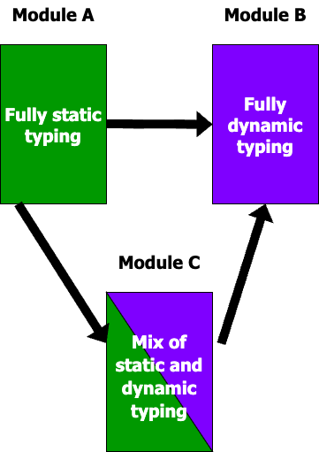
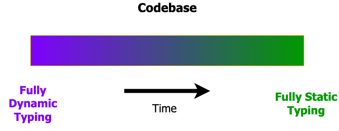

<!-- % Denotational Semantics of Gradual Typing using Synthetic Guarded Domain Theory
% Eric Giovannini, Tingting Ding, and Max S. New
% November 2024
% University of Michigan -->
---
title:  'Denotational Semantics of Gradual Typing using Synthetic Guarded Domain Theory'
subtitle: 'PLS Talk'
author:
- Eric Giovannini
- Tingting Ding
- Max S. New
date: November 2024
institute: 'University of Michigan'
theme: 'CambridgeUS'
shorttitle: 'Denotational Semantics of Gradual Typing...'
---

<!-- ## Outline

1. Introduction and background
   1. Gradual typing
   2. Guarded type theory
2. Key ideas in the model construction
3. Discussion (if time permits) -->


# Introduction and Background

## Big Idea

This work is about constructing a **denotational semantics** that can validate
**relational properties** of **gradually-typed programming languages**

<!-- Interesting relational property we want to prove, and that's where the difficulty is -->

## Gradual Typing: What it Is

**Idea**: Combine static and dynamic typing disciplines in the same language to
obtain the benefits of both styles

<!-- TODO place graphic here -->
\centering
{ width=35% }

## Gradual Typing: Goals

What do we want from a graudally-typed language?

- (*"Gradual"*) Allow the programmer to *gradually* migrate code from a dynamic to static
  style without changing the meaning of the program

\centering
{ width=80%} \

- (*"Typing"*) Support type-based reasoning principles for the statically-typed portions of the codebase

## Gradual Typing: How it Works

<!-- Want to support static reasoning about the language -->
<!-- Want to reason about statically typed code as statically typed code, that the types mean something
So you need to insert casts at runtime to ensure that the types are enforced at runtime -->

- Gradually-typed languages are typically elaborated to a *cast calculus*
$$\text{Surface Language} \to \text{Cast Calculus}$$

Elaboration inserts explicit *type casts* at the boundaries between statically and
dynamically typed code to ensure that the types are enforced at runtime.

::: columns

:::: column
**Surface language**:

~~~~
def foo(x):
  ...

def add1(n : int):
  return n + 1

x : int = ...
y = foo(x)
z = add1(y)
~~~~
::::

:::: column
**Cast calculus**:

~~~~
...
...
...
...
...

x : int = ...
y = foo(cast(int, ?, x))
z = add1(cast(?, int, y))
~~~~
::::

:::

## Cast Calculi

A **dynamic type** $\dyn$ (pronounced "dyn") assigned to dynamically typed terms

- Stands for a statically unknown type

**Type precision**: ordering on types from "least dynamic/most precise" to "most dynamic/least precise":
$$A_1 \ltdyn A_2 \text{ ($A_1$ is more precise than $A_2$)}$$

- Fact: $A \ltdyn \dyn$ for all $A$ ($\dyn$ is the most dynamic)

<!-- - A *dynamic type* $\dyn$ (pronounced "dyn") such that $A \ltdyn \dyn$ for all
  $A$
- The dynamic type is assigned to dynamically typed terms and stands for an
  unknown static type -->

## Term Precision

Type precision extends to an ordering on terms, called **term precision**:
$$M_1 \ltdyn M_2 \text{ ($M_1$ is more precise than $M_2$)}$$

Intuition: The types in $M_1$ are more precise than those in $M_2$ in the type precision ordering

## Casts

For any types $A_1 \ltdyn A_2$, there is an upcast $\up{A_1}{A_2}$ and a downcast $\dn{A_1}{A_2}$.

- The upcast always succeeds, but the downcast may fail (error) at runtime.

- There is a term $\mho$ (pronounced "error") representing runtime error, such that $\mho
  \ltdyn M$ for all $M$.

## Formal Properties of Gradually Typed Languages

<!-- Graduality and soundness are evaluation criteria for the design -->
<!-- - This is formalized via a property called **graduality** -->
<!-- We have syntactically ordered programs, want to say something about their denotations -> need a semantics that models this ordering -->

- **Soundness of the equational theory**: formalizes the idea that the
  statically typed portions of the codebase should enjoy type-based reasoning
  principles.
  - justifies program optimizations

. . .

- **Graduality**: formalizes the idea that migrating from a static to a dynamic
  typing discipline should not change the semantics of the program except to
  catch more errors [@siek_et_al:LIPIcs:2015:5031; @new-ahmed2018].
  - e.g., suppose our language has base type $\nat$
  - Graduality says that if $M \ltdyn N : \nat$,
    then either (1) $M$ errors, or (2) $M$ and $N$ both diverge, or (3) $M$ and $N$ both
    evaluate to the same natural number $n$.
    
. . .

A semantics for a gradually-typed language should validate both of these principles.

## Our Goal in This Work

<!-- We're taking the design criteria as given and will now focus on the semantics -->

**Provide an *expressive*, *reusable*, *compositional* semantic framework for defining
well-behaved semantics of gradually typed programs.**

## Semantics of Gradually-Typed Languages

- Even simple gradually-typed languages are nontrivial to model!
  - Modeling the dynamic type requires solving non-well-founded recursive equations
    $\rightarrow$ **domain theory**
  
  . . .

  - Cast calculi involve effects including divergence and errors
    $\rightarrow$ **monads** or **adjunctions**
  
  . . .

  - Ordering on types and terms $\rightarrow$
    **reflexive graph categories** or **double categories**

<!-- - Effects can be modeled using monads in the
style of Moggi, or adjunctions in the style of
Levy\cite{MOGGI199155,39155,levy99,levystacks}.

Relational properties and their verification
lead naturally to the use of reflexive graph categories or double
categories\cite{dunphythesis,new-licata18}. 
-->

## Prior Approaches

::: columns

:::: column
Denotational models using classical domain theory [@new-licata18]

- Benefit: compositional and reusable
- Limitation: can't scale to advanced, highly self-referential language features
such as higher-order store [@Birkedal-Stovring-Thamsborg-2009]
::::

. . .

:::: column
Operational step-indexed logical relations [@new-ahmed2018; @new-licata-ahmed2019]

- Benefit: handles arbitrary recursive definitions
- Limitation: tedious proofs; difficult to reuse results across different languages
::::

:::

<!-- . . .

- Operational semantics and step-indexed logical relations
  - Benefit: scales to accommodate advanced language features
  - Limitations: heavily syntax dependent; repetitive proofs with little
    opportunity for reuse across developments -->

## Revisting Our Goal

**Provide an *expressive*, *reusable*, *compositional* semantic framework for defining
well-behaved semantics of gradually typed programs.**

- Reusable and compositional $\leadsto$ denotational semantics
- Expressive $\leadsto$ some form of step indexing

## Guarded Domain Theory

- Alternative to classical domain theory that can scale to arbitrarily complex
  definitions

- Based on an entirely different foundations, most commonly ``step-indexed sets'', i.e., objects in the
*topos of trees* [@birkedal-mogelberg-schwinghammer-stovring2011].
  <!-- - A family $\{X_n\}_{n \in \mathbb{N}}$ of sets along with
restriction functions $r_n : X_{n+1} \to X_n$ for all $n$.   -->

- Idea: infinite sequence of increasingly precise approximations to the true
type being modeled.

- Step-indexing can be seen as an *analytic* form of guarded domain theory.


<!-- X_1 represents an approximation after one step, X_2 represents an approximation after two steps, etc.  -->

## Guarded Domain Theory, Continued

- Operator $\later$ (pronounced ``later'') that delays the approximation by one step

- Any guarded domain equation $X \cong F(\later X)$ has a unique solution.
  
- Main difference from classical domain theory: *intensional* nature ---
  unfolding a guarded domain equation requires an observable "step"

<!-- - This allows guarded domain theory to model essentially *any* recursive
concept, with the caveat that the recursion is *guarded* by a use of the later
operator. -->

## Guarded Type Theory

- Synthetic presentation of guarded domain theory
- $\later$ is taken as a primitive operation on types
- Axiom that *guarded* domain equations have a (necessarily unique) solution.
- Benefit: we model an object language type as a *set* instead of a step-indexed set

## Our Goal, Refined

- **Motivating goal**: Adapt the denotational semantics for gradual typing
  based on classical domain theory to the guarded setting.

- Start off with a simple language, and expand to handle advanced features in
  future work

## Contributions

- We define a denotational semantics for a simple gradually-typed cast calculus
  in guarded type theory that validates graduality and the soundness of the
  equational theory.

- Most of our core theorems have been verified in Guarded Cubical Agda.

<!-- 
## Adapting the Classical Domain Theoretic Approach

- **Motivating goal**: Adapt the denotational model of gradual typing
  based on classical domain theory to the guarded setting.

. . .

- Key issue: *intensional* nature of the semantics
  - Unfolding the dynamic type involves an observable computational step

. . .

- Casts take observable steps $\rightarrow$ graduality must be insensitive to steps
  
- So the model must allow for reasoning *up to weak bisimilarity*
  - Two terms are **weakly bisimilar** if they differ only in their
    number of computational steps

## Key Issue in Constructing the Model

- Some amount of transitive reasoning is necessary to define a
syntax-independent model of gradual typing

. . .

- In the guarded setting, it is not possible to reason transitively up to weak bisimilarity!
  (Follows from a no-go theorem we establish)

. . .

- Our solution: combination of strong error ordering + weak bisimilarity

. . .

 Strong error ordering      Weak Bisimilarity
-----------------------    --------------------
  sensitive to steps        insensitive to steps
  transitive reasoning      *not* transitive

. . .

- **syntactic perturbations**: explicit synchronizations that we manipulate syntactically

## Adequacy

## Contributions

- We define a denotational semantics for a simple gradually-typed cast calculus
  in guarded type theory.

- We prove that the model is adequate for the graduality property.

- Most of our core theorems have been verified in Guarded Cubical Agda.

  
## Outline of Remainder of the Talk

1. Describe the syntax of the cast calculus that we will interpret into our model.
2. Give a model for the *terms* of our cast calculus.
3. Extend the model to a relational model.
4. Discuss related and future work.
-->

# Syntax

## Types and Terms

<!-- point out the types we have and the fact that derivations are explicit -->

<!-- We include a syntax for \emph{type precision} derivations $c : A
\ltdyn A'$; the typing is given in Figure~\ref{fig:gtlc-syntax}.
%
Any type precision derivation $c : A \ltdyn A'$ induces a pair of
casts, the upcast $\upc c : A \ra A'$ and the downcast $\dnc c : A' \ra
A$.
%
The syntactic intuition is that $c$ is a proof that $A$ is ``less dynamic'' than
$A'$. Semantically, $c$ denotes a relation between the denotations of $A$ and
$A'$ along with coercions back and forth; the upcast is (to a first-order)
a pure function while the downcast can fail. -->

\begin{figure}
  \begin{mathpar}
  \begin{array}{rcl}
    \text{Types } A &::=& \nat \altbar \,\dyn \altbar A \ra A' \altbar A \times A'\\
    \text{Type Precision } c &::=& r(A) \altbar c c' \altbar c \ra c' \altbar c \times c' \\
        &&\altbar \inat \altbar \itimes \altbar \iarr \\
    \text{Values } V &::=& x \altbar \upc c V \altbar \zro \altbar \suc\, V \altbar \lda{x}{M} \altbar (V,V') \\ 
    \text{Terms } M,N &::=& \err\altbar \upc c M \altbar \dnc c M \altbar \zro \altbar \suc\, M \altbar \lda{x}{M} \\ 
        &&\altbar M\, N \altbar (M,N) \altbar \textrm{let } (x,y) = M \textrm{ in } N\\
    \text{Contexts } \Gamma &::= &\cdot \altbar \Gamma, x : A \\
    \text{Ctx Precision } \Delta &::=& \cdot\altbar \Delta,x:c
  \end{array}
  \end{mathpar}
  \caption{GTLC Cast Calculus Syntax}
  \label{fig:gtlc-syntax}
\end{figure}

## Type Precision Derivations

- Intuition: A type precision derivation $c : A \ltdyn A'$ is a proof that $A$
  is more precise than $A'$

- $c : A \ltdyn A'$ corresponds to a relation between $A$ and $A'$ along with a
pair of coercions in both directions: the upcast $\upc c : A \ra A'$ and the
downcast $\dnc c : A' \ra A$.

## Typing Rules (Selected)

\begin{figure}
  \begin{mathpar}
    \inferrule{}{\Gamma \vdash \mho : A}
  \end{mathpar}
  \begin{mathpar}
  \inferrule
  {\Gamma \vdash M : A \and c : A \ltdyn A'}
  {\Gamma \vdash \upc c M : A'}

  \inferrule
  {\Gamma \vdash N : A' \and c : A \ltdyn A'}
  {\Gamma \vdash \dnc c N : A}

  \end{mathpar}
  \caption{GTLC Typing Rules (Selected)}
  \label{fig:gtlc-typing}
\end{figure}

## Type Precision Rules

\begin{figure}
  \begin{mathpar}
    \inferrule{}{r(A) : A \ltdyn A} \and
    \inferrule{c : A \ltdyn A' \and c' : A' \ltdyn A''}{cc' : A \ltdyn A''} \\
    \inferrule{}{\iarr \colon \dyn \ra \dyn \ltdyn \dyn}\and
    \inferrule{}{\inat \colon \nat \ltdyn \dyn} \and
    \inferrule{}{\itimes \colon \dyn \times \dyn \ltdyn \dyn} \\
    \scalebox{0.80}{\inferrule{c_i : A_i \ltdyn A_i' \and c_o : A_o \ltdyn A_o'}{c_i \ra c_o : (A_i \ra A_o) \ltdyn (A_i' \ra A_o')}}\and
    \scalebox{0.80}{\inferrule{c_1 : A_1 \ltdyn A_1' \and c_2 : A_2 \ltdyn A_2'}{c_1 \times c_2 : (A_1 \times A_2) \ltdyn (A_1' \times A_2')}}
  \end{mathpar}
  \caption{GTLC Type Precision Derivations}
  \label{fig:gtlc-type-prec}
\end{figure}

## Type Precision Equivalence

- Equational theory $c \equiv c'$ for type precision derivations

- Motivation: equivalent derivations $c, c' : A \ltdyn A'$ are not necessarily *equal* in the semantics,
  because we explicitly account for the steps taken by programs

\begin{figure}
  \begin{mathpar}
     r(A)c \equiv c\and
     c \equiv cr(A')\and
     c(c'c'') \equiv (cc')c''\and
     r(A_i \ra A_o) \equiv r(A_i) \ra r(A_o)\and
     r(A_1\times A_2) \equiv r(A_1) \times r(A_2)\and
     (c_i \ra c_o)(c_i' \ra c_o')\equiv (c_ic_i' \ra c_oc_o') \and
     (c_1\times c_2)(c_1'\times c_2')\equiv (c_1c_1' \times c_2c_2')
  \end{mathpar}
  \caption{GTLC Type Precision Equivalence}
  \label{fig:gtlc-type-prec-equiv}
\end{figure}

## Term Precision Rules

- Extension of type precision to terms

- $\Delta \vdash M \ltdyn M' : c$ where $\Delta$ is a context where variables
  are assigned to type precision derivations.

- Not shown: congruence rules for each type constructor, e.g., if
  $M \ltdyn M'$ and $N \ltdyn N'$ then $M\,N \ltdyn M'\,N'$.

\begin{figure}
  \begin{mathpar}
  %(\lambda x. M)(V) = M[V/x] \and (V : A \ra A') = \lambda x. V\,x\\

  % \textrm{let } (x,y) = (V,V') \textrm{ in } N = N[V/x,V'/y] \and
  % M[V:A\times A'/p] = \textrm{let } (x,y) = V \textrm{ in } M[(x,y)/p]

  \inferrule*[right=EquivTyPrec]
  {\Delta\vdash M \ltdyn M' : c \and c \equiv c'}
  {\Delta\vdash M \ltdyn M' : c'}

  \inferrule*[right=ErrBot]
  {}
  {\Delta \vdash \mho \ltdyn M : c}\\

  \inferrule*[right=UpL]
  {M \ltdyn M' : cc_r}
  {\upc {c} M \ltdyn M' : c_r}

  \inferrule*[right=UpR]
  {M \ltdyn M' : c_l}
  {M \ltdyn \upc {c} M' : c_lc}

  \inferrule*[right=DnL]
  {M \ltdyn M' : c_r}
  {\dnc {c} M \ltdyn M' : cc_r}

  \inferrule*[right=DnR]
  {M \ltdyn M' : c_lc}
  {M \ltdyn \dnc {c} M' : c_l}
  \end{mathpar}
  \caption{Term Precision Rules (Selected)}
  \label{fig:term-prec}
\end{figure}

## The Four Cast Rules

The rules $\upl$ and $\upr$ say that the upcast is a *least upper bound* and
dually the rules $\dnl$ and $\dnr$ say that the downcast is a *greatest lower bound*.

- i.e. for upcasts, $\upr$ says that the upcast is less precise than the original term,
  but $\upl$ limits the extent to which it is less precise

\begin{mathpar}
  \inferrule*[right=UpL]
  {M \ltdyn M' : cc_r}
  {\upc {c} M \ltdyn M' : c_r}

  \inferrule*[right=UpR]
  {M \ltdyn M' : c_l}
  {M \ltdyn \upc {c} M' : c_lc}
\end{mathpar}

# A Simple Term Model in Guarded Type Theory

## More about Guarded Type Theory

- Recall: Operator $\later : \type \to \type$
- $\nxt : A \to \later A$ for all $A$
- *Guarded* fixpoint operator $\fix : (\later A \to A) \to A$ satisfying $\fix\, f = f (\nxt (\fix\, f))$
  - Constructing a Prop in this manner corresponds to $\lob$-induction

## Ticked Cubical Type Theory

- Abstract sort $\tick$

- $\later A$ is modeled as the Pi-type $\tick \to A$

- The type $A$ is allowed to depend on $t$; we write $\later_t A$

- Rules are similar to those of ordinary $\Pi$ types

- Notation: $M_t$ for tick application

## A CBPV Model

- Goal of this section: define a model for only the **types and terms** of GTLC

. . .

- We follow the structure of Levy's Call-by-Push-Value [@levy99]
  - Refinement of Moggi's monadic semantics [@MOGGI199155] that decomposes Moggi's monad $T$ into an adjunction $T = UF$:

```{=latex}
% https://q.uiver.app/#q=WzAsNCxbMCwwLCJcXGNhbFYiXSxbMiwwLCJcXGNhbEUiXSxbMCwxLCJcXHRleHR7VmFsdWUgVHlwZXN9XFxcXCtcXFxcXFx0ZXh0e1B1cmUgTW9ycGhpc21zfSJdLFsyLDEsIlxcdGV4dHtDb21wdXRhdGlvbiB0eXBlc31cXFxcK1xcXFxcXHRleHR7SG9tb21vcnBoaXNtc30iXSxbMCwxLCJGIiwwLHsiY3VydmUiOi0zfV0sWzEsMCwiVSIsMCx7ImN1cnZlIjotM31dLFs0LDUsIiIsMCx7ImxldmVsIjoxLCJzdHlsZSI6eyJuYW1lIjoiYWRqdW5jdGlvbiJ9fV1d
\[\begin{tikzcd}[ampersand replacement=\&]
	\calV \&\& \calE \\
	\begin{array}{c} \text{Value Types}\\+\\\text{Pure Morphisms} \end{array} \&\& \begin{array}{c} \text{Computation types}\\+\\\text{Homomorphisms} \end{array}
	\arrow[""{name=0, anchor=center, inner sep=0}, "F", curve={height=-18pt}, from=1-1, to=1-3]
	\arrow[""{name=1, anchor=center, inner sep=0}, "U", curve={height=-18pt}, from=1-3, to=1-1]
	\arrow["\dashv"{anchor=center, rotate=-90}, draw=none, from=0, to=1]
\end{tikzcd}\]
```

<!-- . . .

- $A \rightharpoonup A'$ decomposes into $U(A \to F A')$ where $\arr : \calV^{op} \times \calE \to \calE$ -->

## Value and Computation Categories

- Value category: sets and functions
- Computation category: sets equipped with algebraic structure, and homomorphisms that preserve this structure
- Effects we model: errors and computational steps

<!-- ## Simple Error Domains -->

. . .

\begin{definition}[Simple Error Domains]
  A (simple) error domain $B$ consists of
  \begin{enumerate}
  \item A carrier set $UB$
  \item An element $\mho_{B} : UB$ representing error
  \item A function $\theta_B : \laterhs UB \to UB$ modeling a computational step
  \end{enumerate}
\end{definition}

<!-- Here is our first point where we utilize guarded type theory: rather
than simply being a function $UB \to UB$, the ``think'' map $\theta$
takes an element \emph{later}. This makes a major difference, because
the structure of a think map combined with the guarded fixpoint
operator allows us to define recursive elements of $UB$ in that any
function $f : UB \to UB$ has a ``quasi-fixed point'' $\textrm{qfix}(f)
= \fix(f \circ \theta_B)$ satisfying the quasi-fixed point property:
\[ \qfix(f) = f(\delta_B(\qfix f)) \]
where $\delta_B = \theta_B \circ \nxt$ is a map we call the ``delay''
map which trivially delays an element now to be available later.  As
an example, we can define $\Omega_B = \qfix(\id) : UB$, the
``diverging element'' that ``thinks forever'' in that $\Omega_B =
\delta_B(\Omega_B)$. We call this a ``quasi'' fixed point because it is
\emph{nearly} a fixed point except for the presence of the delay map
$\delta_B$, which is irrelevant from an extensional point of view
where we would prefer to ignore differences in the number of steps
that computations take. -->

## The Free Error Domain

\begin{definition}[Free error domain]
  For a set $A$, we define the (carrier of) \emph{free error domain} $U(\li A)$ as the unique solution to the guarded domain equation:
  \[ U(\li A) \cong A + 1\, + \laterhs U(\li A). \]
  We use the following notation for the three constructors:
  \begin{enumerate}
  \item $\eta \colon A \to U(\li A)$
  \item $\mho \colon U(\li A)$
  \item $\theta \colon \laterhs U(\li A) \to U(\li A)$
  \end{enumerate}
\end{definition}

. . .

- $\mho$ and $\theta$ provide the error domain structure for $\li A$

- Notation: We write $\theta_t(\dots)$ to mean $\theta (\lambda t. \dots)$.

- We define $\delta := \theta \circ \nxt : U(\li A) \to U(\li A)$

## Universal Property of the Free Error Domain

- Any function $f : U(\li A) \to UB$ uniquely extends to a homomorphism
  $f^\dagger : \li A \multimap B$ satisfying $Uf^\dagger \circ \eta = f$.

## Modeling the Type Structure

- $\nat$ denotes the set of natural numbers
- $\times$ denotes the cartesian product of sets.
- CBV function type $A \rightharpoonup A'$ denotes the CBPV decomposition $U(\sem{A} \to \li \sem{A'})$
  - $A \to B$ is the functions from $A$ to $UB$ with the obvious point-wise algebraic structure

## Modeling the Dynamic Type

**Classical domain theory**:

$$D \cong \Nat + (D \times D) + U(D \to \li D)$$

- No inductive or coinductive solutions

. . .

**Guarded domain theory**:

\begin{equation}\label{eq:dyn}
D \cong \Nat + (D \times D)\, + \laterhs U(D \to \li D).
\end{equation}

. . .

- We solve this equation by a mixture of inductive types and guarded fixed
  points (see paper for details).

- We refer to the three injections for numbers, pairs and functions as
  $\inat, \itimes$, and $\iarr$ respectively.

<!-- ## Solving the Equation for the Dynamic Type

- Consider the parameterized inductive type

$$ D'\, X := \mu T. \Nat + (T \times T) + X.$$

. . .

- We construct $D$ as the unique solution to the guarded domain equation

$$D \cong D'(\laterhs U(D \to \li D))$$

. . .

- Expanding the guarded fixed point and least fixed point property gives us that
  $D$ satisfies Equation $\ref{eq:dyn}$.

. . .

- We refer to the three injections for numbers, pairs and functions as
  $\inat, \itimes, \iarr$ respectively. -->

## Interpreting the Terms

- Terms $x:A_1,\ldots \vdash M : A$ are effectful functions
  $\sem{M}: \sem{A_1}\times \cdots \to U\li\sem{A}$

- Values $x:A_1,\ldots \vdash V : A$ are pure functions 
  $\sem{V} : \sem{A_1}\times\cdots \to \sem{A}$.

- Only nontrivial terms: **casts**

## Interpreting Casts

- Upcasts $\leadsto$ pure functions
  - $\sem{\upc c} : \sem{A} \to \sem{A'}$
- Downcasts $\leadsto$ homomorphisms of error domains
  - $\sem{\dnc c} : \li\sem{A'} \multimap \li\sem{A}$.

. . .

- Reflexivity casts $\leadsto$ identities
  - $\sem{\upc{r(A)}} = \id_{\sem{A}}$
  - $\sem{\dnc{r(A)}} = \id_{\li \sem{A}}$

. . .

- Transitivity of type precision $\leadsto$ composition
  - $\sem{\upc{(c \comp c')}} = \sem{\upc{c'}} \circ \sem{\upc{c}}$
  - $\sem{\dnc{(c \comp c')}} = \sem{\dnc{c}} \circ \sem{\dnc{c'}}$

. . .

- Upcasts for products/downcasts for functions $\leadsto$ functorial actions of
  $\times$ and $\to$

. . .

## Interpreting Casts (continued)

- **What about downcasts for products and upcasts for functions?**

<!-- - E.g. for products: given $\sem{\dnc c_1}$ and $\sem{\dnc c_2}$, we need a homomorphism
  $\li(\sem{A_1'} \times \sem{A_2'}) \multimap \li(\sem{A_1} \times \sem{A_2})$.

. . .

- We do this by defining two "Kleisli actions" of the product,
  $\calE(\li A, \li A') \to \calE(\li (A \times A_2), \li(A' \times A_2))$ and
  similarly for the second component.

- We define similar constructions for the arrow type constructor. -->

- See paper for details.

## Casts for the Dynamic Type

- Recall: $D \cong \Nat + (D \times D)\, + \laterhs U(D \to \li D)$.

. . .

- Upcasts are just the injections into the coproduct, except for $\iarr$ where we must precompose with $\nxt$

. . .

- Downcasts perform pattern matching and return the value if it is of the correct type; otherwise error
  - In the function case, the function value is only available later
  - So we must insert a $\theta$ (i.e., take an observable step) to gain access to the function

<!-- 
- \sem{\upc{\inat}} = \inat
- \sem{\upc{\itimes}} = \itimes
- \sem{\upc{\iarr}} = \iarr \circ \nxt

- \sem{\dnc{\inat}} = (
      \lambda V_d . \text{case $({V_d})$ of }
      \{ \inat\,n \to \eta\, n
         \alt \text{otherwise} \to \mho \})^\dagger
- \sem{\dnc{\itimes}} = (
      \lambda V_d . \text{case $({V_d})$ of }
      \{ \itimes(d_1, d_2) \to \eta\, (d_1, d_2)
         \alt \text{otherwise} \to \mho \})^\dagger
- \sem{\dnc{\iarr}} = (
      \lambda V_d . \text{case $({V_d})$ of }
      \{ \iarr \tilde{f} \to \theta_t\, (\eta (\tilde{f}_t))
         \alt \text{otherwise} \to \mho \})^\dagger
          -->

<!-- Lastly, we have the upcasts and downcasts for the injections into the dynamic type, which
are the core primitive casts. The upcasts are simply the injections
themselves, except the function case which must include a $\nxt$ to
account for the fact that the functions are under a later in the
dynamic type. The downcasts are similar in that on values
they pattern match on the input and return it if it is of the correct
type, otherwise erroring. Again, the function case is slightly
different in that if the input is in the function case, then it is
actually only a function available later, and so we must insert a
``think'' in order to return it. -->

## Extracting a Well-Behaved Semantics

- Goal: define a partial ``big-step semantics'' function for closed terms of type nat
$$-\Downarrow : \{M \,|\, \cdot \vdash M : \nat \} \rightharpoonup \mathbb{N} + {\mho}$$

. . .

- **Clock quantification**: method of expressing definitions in ordinary
  set-theoretic foundations internally to guarded type theory

- Idea: All guarded constructs are indexed by a clock $k$, and universally quantifying
  over $k$ allows us to encode coinductive types in guarded type theory

. . .

## Extracting a Well-Behaved Semantics (continued)

- Recall the free error domain: $U\li^k X \cong X + 1 + \later^k U(\li^k X)$
  
- We define a global version of the free error domain:
  - $(\li^{gl} X) := \forall k . (\li^k X)$ (ignoring the $U$)

- We can show that $\li^{gl} X$ is isomorphic to Capretta's *delay monad*
  [@lmcs:2265], the coinductive type generated by
  $\tnow : Y \to \delay(Y)$ and $\tlater : \delay(Y) \to \delay(Y)$.

. . .

- Easy to define a partial function for termination of the delay monad, which
  when combined with the above isomorphism gives the desired big-step semantics
  function $-\Downarrow$.

- See paper for more details.

# Towards a Relational Model

## The Goal

Provide a compositional interpretation of *type* and *term precision*
such that we can extract the graduality relation from our model.

## A Naive Approach

- Idea: enhance our value and computation types to carry a poset structure

- For most type formers the structure is defined functorially

- **Key design choice**: ordering on the free error domain $\li A$.

- First attempt: *step-insensitive error ordering*

## Step-Insensitive Error Ordering

::: columns

:::: column
```{=latex}
\begin{figure}
      \begin{align*}
        \mho \semltbad l &\text{ iff } \top \\
        %
        \eta\, x \semltbad \eta\, y &\text{ iff } 
            x \ltdyn y \\
        %
        \theta\, \tilde{l} \semltbad \theta\, \tilde{l'} &\text{ iff } 
            \later_t (\tilde{l}_t \semltbad \tilde{l'}_t) \\
        %
        \theta\, \tilde{l} \semltbad \mho &\text{ iff } \exists n. \theta\, \tilde{l} = \delta^n(\mho) \\
        %
        \theta\, \tilde{l} \semltbad \eta\, y &\text{ iff } \exists n. \exists x \ltdyn y.
            (\theta\, \tilde{l} = \delta^n(\eta\, x)) \\
        %
        \eta\, x \semltbad \theta\, \tilde{l'} &\text { iff }
            \exists n. \exists y \gtdyn x. (\theta\, \tilde{l'} = \delta^n (\eta\, y))
    \end{align*}
    \caption{Step-insensitive error ordering}
    \label{fig:step-insensitive-error-ordering}
\end{figure}
```
::::

:::: column

- $\mho$ is the bottom element.
- If both sides return values, check whether they are related.
- If both sides think, check that they are related one time step later.
- If one side has terminated and the other is still thinking, the thinking side must terminate with a related behavior.
::::

:::

<!-- The interesting cases are then those where one side is thinking and
the other has completed to either an error or a value.
%
Since the graduality property is \emph{extensional}, i.e., oblivious
to the number of steps taken, it is sensible to say that if one side
has terminated and the other side is thinking, that we must require
the thinking side to eventually terminate with a related behavior,
which is the content of the final three cases of the definition. -->

## Problem: Lack of Transitivity

This relation is *not* a partial ordering, because it is **not transitive**!
<!-- . . .

- Follows from the following theorem.

\begin{theorem}[No-go Theorem]\label{thm:no-go}
  Let $R$ be a binary relation on the free error domain $U(\li A)$. Suppose
  $R$ satisfies the following properties:
  \begin{enumerate}
  \item Transitivity
  \item $\theta$-congruence: If $\later_t (\tilde{x}_t \binrel{R} \tilde{y}_t)$, then $\theta(\tilde{x}) \binrel{R} \theta(\tilde{y})$.
  \item Right step-insensitivity: If $x \binrel{R} y$ then $x \binrel{R} \delta y$.
  \end{enumerate}
  Then for any $l : U(\li A)$, we have $l \binrel{R} \Omega$ where $\Omega = \fix\, \theta$.
  If $R$ is left step-insensitive instead then $\Omega \binrel{R} x$.
\end{theorem}

. . .

\begin{proof}
  By L\"ob induction: we assume that $l$ is related to $\Omega$ later, which implies that
  $\theta (\nxt\, l) \binrel{R} \theta (\nxt\, \Omega)$. Then observe that
  $l \binrel{R} \theta (\nxt\, l) \binrel{R} \theta (\nxt\, \Omega) = \Omega.$
\end{proof}

## Problem: Lack of Transitivity, Continued -->

A relation $R$ on $U(\li A)$ is *right step-insensitive* if $x
\binrel{R} y$ implies $x \binrel{R} \delta y$. Left step-insensitivity is
defined analogously.

\begin{theorem}
  Let $R$ be a binary relation on $U(\li A)$. If $R$ satisfies
  transitivity, $\theta$-congruence and left and right
  step-insensitivity, then $R$ is the total relation: $\forall x, y. x
  \binrel{R} y$.
\end{theorem}

. . .

  <!-- $x \binrel{R} \Omega$ and $\Omega \binrel{R} y$ by the previous
  theorem. Then by transitivity $x \binrel R y$. -->
\begin{proof}
  See paper.
\end{proof}

## Lack of Transitivity (continued)

- $\semltbad$ satisfies $\theta$-congruence and left and right step-insensitivity,
  so if it is also transitive then it is the total relation.

- But e.g., for the flat poset strucutre on $\mathbb N$, $\eta 0 \semltbad \eta 1$ is false.

- Thus $\semltbad$ is **not transitive**.

## Why Transitivity is Necessary

- Q: How to prove graduality compositionally?

. . .

- Let's try to adapt the classical domain-theoretic approach to the guarded setting.

## Proving Graduality Compositionally

- Interpret types as posets and terms as *monotone functions* into the free error domain

- Interpret a type precision derivation $c : A \rel A'$ as a *poset relation* between the posets $\sem{A}$ and $\sem{A'}$

. . .

  - *Downward closed*: if $x' \ltdyn_{A} x$ and $x \mathrel{c} y$, then $x' \mathrel{c} y$.
  - *Upward closed*: if $x \mathrel{c} y$ and $y \ltdyn_{A'} y'$, then $x \mathrel{c} y'$.

. . .

- Given a poset $A$, there is an identity poset relation $r(A)$ given by the poset ordering $\ltdyn_A$
  - **It is a poset relation because it's transitive**

. . .

- Given two poset relations $c : A_1 \rel A_2$ and $c' : A_2 \rel A_3$,
  we define their composition $cc'$ in the usual manner

## Modeling Term Precision

- For closed terms: $\sem{M \ltdyn M' : c}$ is defined to be the relation $\sem{M} \binrel{(U\li\sem{c})} \sem{M'}$

. . .

- For open terms: need a relationship between the denoted monotone functions
  - We say that $f \ltsq{c_i}{c_o} g$ if for all $x : A_i$ and $y : A_i'$ with $x \binrel{c_i} y$, we have $f(x) \binrel{c_o} g(y)$
  - We call this relationship a *square*

. . .

$$
\begin{tikzcd}[ampersand replacement=\&]
  {A_i} \& {A_i'} \\
  {A_o} \& {A_o'}
  \arrow["{c_i}", "\shortmid"{marking}, no head, from=1-1, to=1-2]
  \arrow["f"', from=1-1, to=2-1]
  \arrow["g", from=1-2, to=2-2]
  \arrow["{c_o}"', "\shortmid"{marking}, no head, from=2-1, to=2-2]
\end{tikzcd}
$$

## Squares

- ``vertical identity'' square $\id \ltsq{c}{c} \id$ for any $c$
- ``horizontal identity'' square $f \ltsq{r(A_i)}{r(A_o)} f$ for any monotone function $f : A_i \to A_o$

\vspace{4ex}

. . .

::: columns

:::: column
**Vertical composition**:

If $f \ltsq{c_1}{c_2} f'$ and $g \ltsq{c_2}{c_3} g'$,
then $g \circ f \ltsq{c_1}{c_3} g' \circ f'$

```{=latex}
% https://q.uiver.app/#q=WzAsNixbMCwwLCJBXzEiXSxbMCwxLCJBXzIiXSxbMCwyLCJBXzMiXSxbMSwwLCJBXzEnIl0sWzEsMSwiQV8yJyJdLFsxLDIsIkFfMyciXSxbMCwzLCJjXzEiLDAseyJzdHlsZSI6eyJib2R5Ijp7Im5hbWUiOiJiYXJyZWQifSwiaGVhZCI6eyJuYW1lIjoibm9uZSJ9fX1dLFsxLDQsImNfMiIsMCx7InN0eWxlIjp7ImJvZHkiOnsibmFtZSI6ImJhcnJlZCJ9LCJoZWFkIjp7Im5hbWUiOiJub25lIn19fV0sWzIsNSwiY18zIiwwLHsic3R5bGUiOnsiYm9keSI6eyJuYW1lIjoiYmFycmVkIn0sImhlYWQiOnsibmFtZSI6Im5vbmUifX19XSxbMCwxLCJmIiwyXSxbMSwyLCJnIiwyXSxbMyw0LCJmJyJdLFs0LDUsImcnIl1d
\[\begin{tikzcd}[ampersand replacement=\&]
	{A_1} \& {A_1'} \\
	{A_2} \& {A_2'} \\
	{A_3} \& {A_3'}
	\arrow["{c_1}", "\shortmid"{marking}, no head, from=1-1, to=1-2]
	\arrow["f"', from=1-1, to=2-1]
	\arrow["{f'}", from=1-2, to=2-2]
	\arrow["{c_2}", "\shortmid"{marking}, no head, from=2-1, to=2-2]
	\arrow["g"', from=2-1, to=3-1]
	\arrow["{g'}", from=2-2, to=3-2]
	\arrow["{c_3}", "\shortmid"{marking}, no head, from=3-1, to=3-2]
\end{tikzcd}
\]
```
::::

:::: column
**Horizontal composition**:

If $f \ltsq{c_i}{c_o} g$ and $g \ltsq{c_i'}{c_o'} h$,
then $f \ltsq{c_i c_i'}{c_o c_o'} h$.

```{=latex}
% https://q.uiver.app/#q=WzAsNixbMCwwLCJBX2kiXSxbMSwwLCJBX2knIl0sWzAsMSwiQV9vIl0sWzEsMSwiQV9vJyJdLFsyLDAsIkFfaScnIl0sWzIsMSwiQV9vJyciXSxbMCwxLCJjX2kiLDAseyJzdHlsZSI6eyJib2R5Ijp7Im5hbWUiOiJiYXJyZWQifSwiaGVhZCI6eyJuYW1lIjoibm9uZSJ9fX1dLFsxLDQsImNfaSciLDAseyJzdHlsZSI6eyJib2R5Ijp7Im5hbWUiOiJiYXJyZWQifSwiaGVhZCI6eyJuYW1lIjoibm9uZSJ9fX1dLFsyLDMsImNfbyIsMix7InN0eWxlIjp7ImJvZHkiOnsibmFtZSI6ImJhcnJlZCJ9LCJoZWFkIjp7Im5hbWUiOiJub25lIn19fV0sWzMsNSwiY19vJyIsMix7InN0eWxlIjp7ImJvZHkiOnsibmFtZSI6ImJhcnJlZCJ9LCJoZWFkIjp7Im5hbWUiOiJub25lIn19fV0sWzAsMiwiZiIsMl0sWzEsMywiZyIsMl0sWzQsNSwiaCIsMl1d
\[\begin{tikzcd}[ampersand replacement=\&]
	{A_i} \& {A_i'} \& {A_i''} \\
	{A_o} \& {A_o'} \& {A_o''}
	\arrow["{c_i}", "\shortmid"{marking}, no head, from=1-1, to=1-2]
	\arrow["f"', from=1-1, to=2-1]
	\arrow["{c_i'}", "\shortmid"{marking}, no head, from=1-2, to=1-3]
	\arrow["g"', from=1-2, to=2-2]
	\arrow["h"', from=1-3, to=2-3]
	\arrow["{c_o}"', "\shortmid"{marking}, no head, from=2-1, to=2-2]
	\arrow["{c_o'}"', "\shortmid"{marking}, no head, from=2-2, to=2-3]
\end{tikzcd}\]
```
::::

:::

## The Graduality Proof

- Goal: interpret **term precision rules**

- Most cases are just congruence rules and are easy to establish
  - Use composition of squares and functorial actions of the type constructios on squares

. . .

- The core of the proof of graduality: proving the validity
  of the **cast rules** $\upl$, $\upr$, $\dnl$, and $\dnr$.

## Representable Relations

- The four cast rules specify a relationship between the semantics of type
precision derivations $c$ and the corresponding casts $\upc c, \dnc c$

<!-- - E.g. \upl rule: if $c : A_1 \ltdyn A_2$ and $c' : A_2 \ltdyn A_3$ and 
  $M : A_1$ is related to $N : A_3$ via $c \comp c'$, then $\upc{c} M$ is related to $N$ via $c'$. -->

. . .

::: columns

:::: column
\begin{mathpar}
  \inferrule*[right=UpL]
  {M \ltdyn M' : cc_r}
  {\upc {c} M \ltdyn M' : c_r}
\end{mathpar}
::::

:::: column
```{=latex}
\[\begin{tikzcd}[ampersand replacement=\&]
  {\sem{A_1}} \& {\sem{A_2}} \& {\sem{A_3}} \\
  {\sem{A_2}} \&\& {\sem{A_3}}
  \arrow["\sem{c}", "\shortmid"{marking}, no head, from=1-1, to=1-2]
  \arrow["{\sem{\upc{c}}}"', from=1-1, to=2-1]
  \arrow["{\sem{c'}}", "\shortmid"{marking}, no head, from=1-2, to=1-3]
  \arrow["\id", from=1-3, to=2-3]
  \arrow["{\sem{c'}}"', "\shortmid"{marking}, no head, from=2-1, to=2-3]
\end{tikzcd}\]
```
::::

:::

. . .

- Problem: this rule quantifies over an arbitrary relation $\sem{c'}$!
- This means the definition of relation is self-referential!

<!-- While at first look this seems to be specifying a relationship between
$\sem{c}$ and $\sem{\upc c}$, there is a problem: it also quantifies
over an arbitrary other relation $\sem{c'}$! This means we cannot
require the existence of this square as part of the definition of a
relation between value types, as it is self-referential. This would
seem to imply that we cannot give a compositional model for
graduality. However, New and Licata observed that in the presence of
transitivity, we can \emph{derive} the above squares from simpler ones
that do not involve composition of relations. Below are the simpler squares
corresponding to $\upl$, $\upr$, $\dnl$, and $\dnr$: -->

## A Simpler Square

Consider this simpler square:

```{=latex}
\[\begin{tikzcd}[ampersand replacement=\&]
      {A_1} \& {A_2} \\
      {A_2} \& {A_2}
      \arrow["c", "\shortmid"{marking}, no head, from=1-1, to=1-2]
      \arrow[""{name=0, anchor=center, inner sep=0}, "{\upc{c}}"', from=1-1, to=2-1]
      \arrow[""{name=1, anchor=center, inner sep=0}, "\id", from=1-2, to=2-2]
      \arrow["{r(A_2)}"', "\shortmid"{marking}, no head, from=2-1, to=2-2]
      \arrow["{\text{UpL}}"{marking, allow upside down}, draw=none, from=0, to=1]
\end{tikzcd}\]
```

- This square, in conjunction with a related one for $\upr$, say that the
  relation $c$ is *representable* by the morphism $\upc{c}$

## Composing the Squares

Derive the original $\upl$ square from the simpler $\upl$ square:

```{=latex}
\[\begin{tikzcd}[ampersand replacement=\&]
	{A_1} \& {A_2} \& {A_3} \\
	{A_2} \& {A_2} \& {A_3}
	\arrow["c", "\shortmid"{marking}, no head, from=1-1, to=1-2]
	\arrow["{\upc{c}}"', from=1-1, to=2-1]
	\arrow["{c'}", "\shortmid"{marking}, no head, from=1-2, to=1-3]
	\arrow["\id"', from=1-2, to=2-2]
	\arrow["\id", from=1-3, to=2-3]
	\arrow["{r(A_2)}"', "\shortmid"{marking}, no head, from=2-1, to=2-2]
	\arrow["{c'}"', "\shortmid"{marking}, no head, from=2-2, to=2-3]
\end{tikzcd}\]
```

The composition of $r(A_2)$ with $c'$ is equal to $c'$, because $c'$ is *downward-closed*

. . .

We can similarly derive the squares for the other three rules by composition.

## Simpler Squares

\begin{center}
  \begin{tabular}{ c | c }
    % UpL
    % https://q.uiver.app/#q=WzAsNCxbMCwwLCJBXzEiXSxbMCwxLCJBXzIiXSxbMSwwLCJBXzIiXSxbMSwxLCJBXzIiXSxbMCwyLCJjIiwwLHsic3R5bGUiOnsiYm9keSI6eyJuYW1lIjoiYmFycmVkIn0sImhlYWQiOnsibmFtZSI6Im5vbmUifX19XSxbMSwzLCJyKEFfMikiLDIseyJzdHlsZSI6eyJib2R5Ijp7Im5hbWUiOiJiYXJyZWQifSwiaGVhZCI6eyJuYW1lIjoibm9uZSJ9fX1dLFswLDEsIlxcdXBje2N9IiwyXSxbMiwzLCJcXGlkIl0sWzYsNywiXFx0ZXh0e1VwTH0iLDMseyJzaG9ydGVuIjp7InNvdXJjZSI6MjAsInRhcmdldCI6MjB9LCJzdHlsZSI6eyJib2R5Ijp7Im5hbWUiOiJub25lIn0sImhlYWQiOnsibmFtZSI6Im5vbmUifX19XV0=
    \begin{tikzcd}[ampersand replacement=\&]
      {A_1} \& {A_2} \\
      {A_2} \& {A_2}
      \arrow["c", "\shortmid"{marking}, no head, from=1-1, to=1-2]
      \arrow[""{name=0, anchor=center, inner sep=0}, "{\upc{c}}"', from=1-1, to=2-1]
      \arrow[""{name=1, anchor=center, inner sep=0}, "\id", from=1-2, to=2-2]
      \arrow["{r(A_2)}"', "\shortmid"{marking}, no head, from=2-1, to=2-2]
      \arrow["{\text{UpL}}"{marking, allow upside down}, draw=none, from=0, to=1]
  \end{tikzcd} &
    %
    % UpR
    % https://q.uiver.app/#q=WzAsNCxbMCwwLCJBXzEiXSxbMCwxLCJBXzEiXSxbMSwwLCJBXzEiXSxbMSwxLCJBXzIiXSxbMCwyLCJyKEFfMSkiLDAseyJzdHlsZSI6eyJib2R5Ijp7Im5hbWUiOiJiYXJyZWQifSwiaGVhZCI6eyJuYW1lIjoibm9uZSJ9fX1dLFsxLDMsImMiLDIseyJzdHlsZSI6eyJib2R5Ijp7Im5hbWUiOiJiYXJyZWQifSwiaGVhZCI6eyJuYW1lIjoibm9uZSJ9fX1dLFswLDEsIlxcaWQiLDJdLFsyLDMsIlxcdXBjIGMiXSxbNiw3LCJcXHRleHR7VXBSfSIsMyx7InNob3J0ZW4iOnsic291cmNlIjoyMCwidGFyZ2V0IjoyMH0sInN0eWxlIjp7ImJvZHkiOnsibmFtZSI6Im5vbmUifSwiaGVhZCI6eyJuYW1lIjoibm9uZSJ9fX1dXQ==
    \begin{tikzcd}[ampersand replacement=\&]
      {A_1} \& {A_1} \\
      {A_1} \& {A_2}
      \arrow["{r(A_1)}", "\shortmid"{marking}, no head, from=1-1, to=1-2]
      \arrow[""{name=0, anchor=center, inner sep=0}, "\id"', from=1-1, to=2-1]
      \arrow[""{name=1, anchor=center, inner sep=0}, "{\upc c}", from=1-2, to=2-2]
      \arrow["c"', "\shortmid"{marking}, no head, from=2-1, to=2-2]
      \arrow["{\text{UpR}}"{marking, allow upside down}, draw=none, from=0, to=1]
    \end{tikzcd} \\ \hline
    %
    %
    %
    % DnL
    % https://q.uiver.app/#q=WzAsNCxbMCwwLCJBXzIiXSxbMCwxLCJBXzEiXSxbMSwwLCJBXzIiXSxbMSwxLCJBXzIiXSxbMCwyLCJyKEFfMikiLDAseyJzdHlsZSI6eyJib2R5Ijp7Im5hbWUiOiJiYXJyZWQifSwiaGVhZCI6eyJuYW1lIjoibm9uZSJ9fX1dLFsxLDMsImMiLDIseyJzdHlsZSI6eyJib2R5Ijp7Im5hbWUiOiJiYXJyZWQifSwiaGVhZCI6eyJuYW1lIjoibm9uZSJ9fX1dLFswLDEsIlxcZG5jIGMiLDJdLFsyLDMsIlxcaWQiXSxbNiw3LCJcXHRleHR7RG5MfSIsMyx7InNob3J0ZW4iOnsic291cmNlIjoyMCwidGFyZ2V0IjoyMH0sInN0eWxlIjp7ImJvZHkiOnsibmFtZSI6Im5vbmUifSwiaGVhZCI6eyJuYW1lIjoibm9uZSJ9fX1dXQ==
    \begin{tikzcd}[ampersand replacement=\&]
      {A_2} \& {A_2} \\
      {A_1} \& {A_2}
      \arrow["{r(A_2)}", "\shortmid"{marking}, no head, from=1-1, to=1-2]
      \arrow[""{name=0, anchor=center, inner sep=0}, "{\dnc c}"', from=1-1, to=2-1]
      \arrow[""{name=1, anchor=center, inner sep=0}, "\id", from=1-2, to=2-2]
      \arrow["c"', "\shortmid"{marking}, no head, from=2-1, to=2-2]
      \arrow["{\text{DnL}}"{marking, allow upside down}, draw=none, from=0, to=1]
    \end{tikzcd} &
    %
    % DnR
    % https://q.uiver.app/#q=WzAsNCxbMCwwLCJBXzEiXSxbMCwxLCJBXzEiXSxbMSwwLCJBXzIiXSxbMSwxLCJBXzEiXSxbMCwyLCJjIiwwLHsic3R5bGUiOnsiYm9keSI6eyJuYW1lIjoiYmFycmVkIn0sImhlYWQiOnsibmFtZSI6Im5vbmUifX19XSxbMSwzLCJyKEFfMSkiLDIseyJzdHlsZSI6eyJib2R5Ijp7Im5hbWUiOiJiYXJyZWQifSwiaGVhZCI6eyJuYW1lIjoibm9uZSJ9fX1dLFswLDEsIlxcaWQiLDJdLFsyLDMsIlxcZG5jIGMiXSxbNiw3LCJcXHRleHR7RG5SfSIsMyx7InNob3J0ZW4iOnsic291cmNlIjoyMCwidGFyZ2V0IjoyMH0sInN0eWxlIjp7ImJvZHkiOnsibmFtZSI6Im5vbmUifSwiaGVhZCI6eyJuYW1lIjoibm9uZSJ9fX1dXQ==
    \begin{tikzcd}[ampersand replacement=\&]
      {A_1} \& {A_2} \\
      {A_1} \& {A_1}
      \arrow["c", "\shortmid"{marking}, no head, from=1-1, to=1-2]
      \arrow[""{name=0, anchor=center, inner sep=0}, "\id"', from=1-1, to=2-1]
      \arrow[""{name=1, anchor=center, inner sep=0}, "{\dnc c}", from=1-2, to=2-2]
      \arrow["{r(A_1)}"', "\shortmid"{marking}, no head, from=2-1, to=2-2]
      \arrow["{\text{DnR}}"{marking, allow upside down}, draw=none, from=0, to=1]
    \end{tikzcd}
  \end{tabular}
\end{center}

## Key Takeaway

We can carry out the graduality proof compositionally,
*provided that the relations $\sem{c}$ are closed under the orderings on each side*.

**In particular, the ordering relations $r(A)$ must be transitive.**

<!-- **Some amount of transitive reasoning is necessary!** -->

## Returning to the Free Error Domain

- Recall: The step-insensitive error ordering is not transitive

- Solution: Give up on step-insensitivity

## Lock-Step Error Ordering

Lock-step error ordering \fbox{$l_1 \ltls l_2$}
  \begin{align*}
    &\eta\, x \ltls \eta\, y \text{ if } 
        x \mathbin{\ltdyn_A} y \\
    %
    &\mho \ltls l' \\
    %
    &\theta\, \tilde{l} \ltls \theta\, \tilde{l'} \text{ if }
        \later_t (\tilde{l}_t \ltls \tilde{l'}_t)
  \end{align*}

- The partial ordering for $U\li A$ is the lock-step error ordering.

- We similarly define a heterogeneous version of the lock-step ordering that lifts
poset relation $c : A \rel A'$ to a poset relation $\li c : \li A \rel \li A'$.

## Accounting for Steps Taken by Casts

**Observation**: there are terms related by term precision that take differing
numbers of steps.

<!-- Recall: $D \cong \Nat + (D \times D)\, + \laterhs U(D \to \li D)$. -->

Consider the $\dnl$ square corresponding to the type precision derivation
$\iarr \colon \dyntodyn \ltdyn\, \dyn$

```{=latex}
\[\begin{tikzcd}[ampersand replacement=\&]
	{\li D} \& {\li D} \\
	{\li U(D \arr \li D)} \& {\li D}
	\arrow["{r(\li D)}", "\shortmid"{marking}, no head, from=1-1, to=1-2]
	\arrow["{\sem{\dnc{\iarr}}}"', from=1-1, to=2-1]
	\arrow["\id", from=1-2, to=2-2]
	\arrow["\li\sem{\iarr}"', "\shortmid"{marking}, no head, from=2-1, to=2-2]
\end{tikzcd}\]
```

The RHS always takes zero steps, while the LHS takes a step if the input is a function!

## Inserting a Delay

**Solution**: insert a delay function $\delta^* = (\delta \circ \eta)^\dagger$ on the RHS
(recall $\delta : U(\li A) \to U(\li A)$)
  
```{=latex}
\[\begin{tikzcd}[ampersand replacement=\&]
	{\li D} \& {\li D} \\
	{\li U(D \arr \li D)} \& {\li D}
	\arrow["{r(\li D)}", "\shortmid"{marking}, no head, from=1-1, to=1-2]
	\arrow["{\sem{\dnc{\iarr}}}"', from=1-1, to=2-1]
	\arrow["\delta^*", from=1-2, to=2-2]
	\arrow["\li\sem{\iarr}"', "\shortmid"{marking}, no head, from=2-1, to=2-2]
\end{tikzcd}\]
```

**Now both sides are in lock step!**

We call a function that is the identity function except for the introduction of
computational steps a **semantic perturbation**.

## Weak Bisimilarity on the Free Error Domain

- **Idea**: formalize the property of being equivalent "except for steps"

- Parameterized by a reflexive, symmetric relation on $A$

Weak bisimilarity \fbox{$l_1 \bisim l_2$}
  \begin{align*}
      \mho \bisim \mho &\text{ iff } \top \\
    %
      \eta\, x \bisim \eta\, y &\text{ iff } x \bisim_A y \\
    %		
      \theta\, \tilde{x} \bisim \theta\, \tilde{y} &\text{ iff } \later_t (\tilde{x}_t \bisim \tilde{y}_t) \\
    %	
      \theta\, \tilde{x} \bisim \mho &\text{ iff } \exists n. \theta\, \tilde{x} = \delta^n(\mho)\\
    %	
      \theta\, \tilde{x} \bisim \eta\, y &\text{ iff } \exists n. \exists x \bisim_A y.
        (\theta\, \tilde{x} = \delta^n(\eta\, x))\\
    %
      \mho \bisim \theta\, \tilde{y} &\text{ iff } \exists n. \theta\, \tilde{y} = \delta^n(\mho) \\
    %	
      \eta\, x \bisim \theta\, \tilde{y} &\text { iff } \exists n. \exists y \bisim_A x. (\theta\, \tilde{y} = \delta^n (\eta\, y))
  \end{align*}

<!-- Two errors are bisimilar, and when both sides are $\eta$, we ensure
that the underlying values are bisimilar in the underlying
bisimilarity relation on $A$. When both sides are thinking, we ensure
the terms are bisimilar later.  Most importantly, when one side is
thinking but the other terminates at $\eta x$ (i.e., one side steps),
we stipulate that the $\theta$-term runs to $\eta y$ where $x$ is
related to $y$. And similarly, if one side is thinking and the other
errors, we ensure the thinking side eventually errors. -->

## Summary of Relations on the Free Error Domain

Lock-step error ordering        Weak Bisimilarity
---------------------------   ---------------------
  sensitive to steps             insensitive to steps
  transitive                     *not* transitive
  accounts for errors            only relates terms with same stepping behavior

## New Interpretation of Term Precision

$\Delta \vdash M \ltdyn N : c$ means not that $\sem{M}$ and $\sem{N}$ are
necessarily in the lock-step error ordering directly, but that they can be
``synchronized'' to do so, i.e.:

There exist $f \bisim \sem{M}$ and $g \bisim \sem{N}$ such that
$f \ltsq{\sem{\Delta}}{U\li\sem{c}} g$.

# Completing the Model

## Note

This section gives a high-level overview; much more detail can be found in Section
5 of the paper.

## Changes to the Poset Semantics

- Equip all types with a *bisimilarity relation* in addition to an ordering relation

- Morphisms must preserve **both** relations

- Define semantic perturbations as endomorphisms that are weakly bisimilar to
  the identity morphism

## Changes to the Poset Semantics (continued)

- Weaken the notion of representability so that the upcasts and downcasts are
not required to be in lock-step with the identity but instead with
some *perturbation*.
  - We call this notion *quasi-representability*

- E.g. the modified $\upl$ rule:

```{=latex}
% https://q.uiver.app/#q=WzAsNCxbMCwwLCJBIl0sWzAsMSwiQSciXSxbMSwwLCJBJyJdLFsxLDEsIkEnIl0sWzAsMSwiXFx1cGN7Y30iLDJdLFsyLDMsIlxcZGVsdGFfY15yIl0sWzAsMiwiYyIsMCx7InN0eWxlIjp7ImJvZHkiOnsibmFtZSI6ImJhcnJlZCJ9LCJoZWFkIjp7Im5hbWUiOiJub25lIn19fV0sWzEsMywicihBJykiLDIseyJzdHlsZSI6eyJib2R5Ijp7Im5hbWUiOiJiYXJyZWQifSwiaGVhZCI6eyJuYW1lIjoibm9uZSJ9fX1dXQ==
\[\begin{tikzcd}[ampersand replacement=\&]
	A \& {A'} \\
	{A'} \& {A'}
	\arrow["c", "\shortmid"{marking}, no head, from=1-1, to=1-2]
	\arrow["{\upc{c}}"', from=1-1, to=2-1]
	\arrow["{\delta_c^r}", from=1-2, to=2-2]
	\arrow["{r(A')}"', "\shortmid"{marking}, no head, from=2-1, to=2-2]
\end{tikzcd}\]
```

## Finishing the Graduality Proof

- Remainder of the proof: show that quasi-representability is preserved by the
constructions on type precision.

- **Problem**: the perturbations are not as well-behaved as actual identity
  functions

- **Solution**: attach additional data to our types that is associated with
  semantic perturbations but that we can manipulate syntactically

## Syntactic Perturbations

- A syntactic representation of semantic perturbations

- Presented as data associated to each type so that they are amenable to
  operations such as composition and functorial actions

- Each type is equipped with a monoid of syntactic perturbations and a means of
  *interpreting* them as semantic perturbations.

## Push and Pull

Need to impose an additional condition saying how relations interact with
syntactic perturbations:

  - We can *push* a perturbation $\delta_1$ on $A$ to a perturbation
    $\push(\delta_1)$ on $A'$ such that the following square exists:

```{=latex}
  % https://q.uiver.app/#q=WzAsNCxbMCwwLCJBIl0sWzEsMCwiQSciXSxbMCwxLCJBIl0sWzEsMSwiQSciXSxbMCwxLCJjIiwwLHsic3R5bGUiOnsiYm9keSI6eyJuYW1lIjoiYmFycmVkIn0sImhlYWQiOnsibmFtZSI6Im5vbmUifX19XSxbMiwzLCJjIiwyLHsic3R5bGUiOnsiYm9keSI6eyJuYW1lIjoiYmFycmVkIn0sImhlYWQiOnsibmFtZSI6Im5vbmUifX19XSxbMCwyLCJcXGRlbHRhXzEiLDJdLFsxLDMsIlxcdGV4dHtwdXNofShcXGRlbHRhXzEpIl1d
\[\begin{tikzcd}[ampersand replacement=\&]
	A \& {A'} \\
	A \& {A'}
	\arrow["c", "\shortmid"{marking}, no head, from=1-1, to=1-2]
	\arrow["{\delta_1}"', from=1-1, to=2-1]
	\arrow["{\text{push}(\delta_1)}", from=1-2, to=2-2]
	\arrow["c"', "\shortmid"{marking}, no head, from=2-1, to=2-2]
\end{tikzcd}\]
```

- Likewise we can *pull* a perturbation on $A'$ to one on $A$

## Last Step: Extensional Squares

- Define a notion of *extensional square* combining bisimilarity with the error ordering:

```{=latex}
% https://q.uiver.app/#q=WzAsNCxbMCwwLCJBX2kiXSxbMCwxLCJBX28iXSxbMiwwLCJBX2knIl0sWzIsMSwiQV9vJyJdLFswLDEsImYiLDIseyJjdXJ2ZSI6Mn1dLFswLDEsImYnIiwwLHsiY3VydmUiOi0yfV0sWzAsMiwiY19pIiwwLHsic3R5bGUiOnsiYm9keSI6eyJuYW1lIjoiYmFycmVkIn0sImhlYWQiOnsibmFtZSI6Im5vbmUifX19XSxbMSwzLCJjX28iLDIseyJzdHlsZSI6eyJib2R5Ijp7Im5hbWUiOiJiYXJyZWQifSwiaGVhZCI6eyJuYW1lIjoibm9uZSJ9fX1dLFsyLDMsImcnIiwyLHsiY3VydmUiOjJ9XSxbMiwzLCJnIiwwLHsiY3VydmUiOi0yfV0sWzgsOSwiXFxiaXNpbSIsMSx7InNob3J0ZW4iOnsic291cmNlIjoyMCwidGFyZ2V0IjoyMH0sInN0eWxlIjp7ImJvZHkiOnsibmFtZSI6Im5vbmUifSwiaGVhZCI6eyJuYW1lIjoibm9uZSJ9fX1dLFs0LDUsIlxcYmlzaW0iLDEseyJzaG9ydGVuIjp7InNvdXJjZSI6MjAsInRhcmdldCI6MjB9LCJzdHlsZSI6eyJib2R5Ijp7Im5hbWUiOiJub25lIn0sImhlYWQiOnsibmFtZSI6Im5vbmUifX19XSxbNSw4LCJcXGx0ZHluIiwxLHsic2hvcnRlbiI6eyJzb3VyY2UiOjIwLCJ0YXJnZXQiOjIwfSwic3R5bGUiOnsiYm9keSI6eyJuYW1lIjoibm9uZSJ9LCJoZWFkIjp7Im5hbWUiOiJub25lIn19fV1d
\[\begin{tikzcd}[ampersand replacement=\&]
	{A_i} \&\& {A_i'} \\
	{A_o} \&\& {A_o'}
	\arrow["{c_i}", "\shortmid"{marking}, no head, from=1-1, to=1-3]
	\arrow[""{name=0, anchor=center, inner sep=0}, "f"', curve={height=12pt}, from=1-1, to=2-1]
	\arrow[""{name=1, anchor=center, inner sep=0}, "{f'}", curve={height=-12pt}, from=1-1, to=2-1]
	\arrow[""{name=2, anchor=center, inner sep=0}, "{g'}"', curve={height=12pt}, from=1-3, to=2-3]
	\arrow[""{name=3, anchor=center, inner sep=0}, "g", curve={height=-12pt}, from=1-3, to=2-3]
	\arrow["{c_o}"', "\shortmid"{marking}, no head, from=2-1, to=2-3]
	\arrow["\bisim"{description}, draw=none, from=0, to=1]
	\arrow["\ltdyn"{description}, draw=none, from=1, to=2]
	\arrow["\bisim"{description}, draw=none, from=2, to=3]
\end{tikzcd}\]
```

## Relational Adequacy

Show that for closed terms of base type, term precision implies that the
the big-step term semantics satisfies the graduality property.

\begin{theorem}
If $M \ltdyn N : nat$ then either:

  1. $M \Downarrow \mho$

  2. $M \Downarrow$ and $N \Downarrow$ are both undefined

  3. $M \Downarrow n$ and $N \Downarrow n$

where $-\Downarrow$ is the big-step term semantics (a partial function from
terms to $\mathbb{N} + {\mho}$)
\end{theorem}


- See paper for the proof!

<!-- ## Summary of the Model

- Value types $A$ --- posets with a bisimilarity relation and a monoid of
  syntactic perturbations
- Computation types $B$ --- all of the above + an error element and a $\theta$
  map
- Value morphisms $c$ ---  -->


<!--
# Completing the Model

## Phase 1: Predomains and Error Domains

## Value and Computation Objects

## Quasi-Representable Relations

## Manipulating Perturbations: Push-Pull

## Summary of the Model

## Relational Adequacy -->

# Discussion and Future Work

## Agda Mechanization

- Formalized most of the key pieces of the model construction in Guarded Cubical Agda [@veltri-vezzosi2020]
  - Predomain/error domains, morphisms, relations, squares
  - Free error domain
  - Value/computation objects, syntactic perturbations, semantic perturbations, push-pull property
  - Quasi-representable relations
  - The dynamic type as a value object, along with the relations corresponding to the three injections
  - Adequacy of the model with respect to the graduality property

. . .

- Some formalization work remains:
  - Lemmas about quasi-representability of actions of $\to$ and $\times$ on relations
  - Verifying type precision equivalence rules in the semantics
  
- https://github.com/ericgiovannini/gradual-typing-semantics-in-sgdt

## Future Work

- Extend to languages with higher-order store and/or dynamic type-tag generation
- Prove graduality for alternative cast semantics, e.g., eager
  [@herman-tomb-flanagan-2010] and transient [@transient] cast
  semantics
- Utilize the *intensional* nature of our model to analyze the efficiency of
  different cast semantics

## End

\centering
**Thank you!**

## References

::: {#refs}
:::

<!--
Length-indexed lists:

~~~~ {mathescape="true"}
Inductive vec (A : $\square$) : $\mathbb{N} \to \square$ :=
| nil : vec A 0
| cons : A $\to$ forall n : $\nat$, vec A n $\to$ vec A (S n).
~~~~

Total head function:

~~~~ {mathescape="true"}
head : forall A n, vec A (S n) $\to$ A
~~~~
-->

